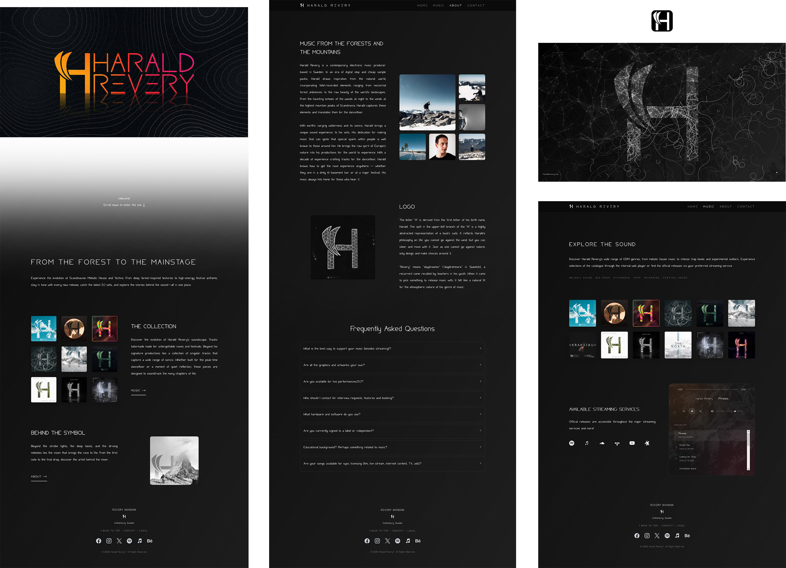
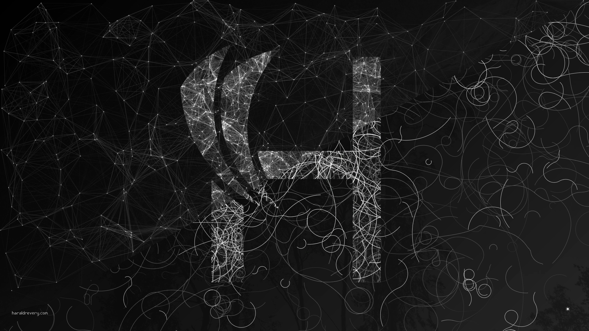

# Harald Revery official website
 
 

---

## Harald Revery official website, made with Tailwind CSS, Alpine.js and GLightbox.
Alpine.js was used for "navigation bar reveal when scroll" on older browsers and to run a custom made audio player. GLightbox for pop out image sliders when the user clicks an image (the CSS trick was not good enough). 

* Tailwind CSS: [Website](https://tailwindcss.com/), [Github](https://github.com/tailwindlabs/tailwindcss)
* Alpine.js [Website](https://alpinejs.dev/), [Github](https://github.com/alpinejs/alpine)
* GLightbox [Website](https://biati-digital.github.io/glightbox/), [Github](https://github.com/biati-digital/glightbox)


Main LLM models used to generate and troubleshoot code:
* Anthropic: Claude AI (Sonnet 4.5)
* Google: Gemini 
* xAI: Grok

## Notebook (blog/article part)
To get the blog ("notebook") have a nice structure and so on, I used Eleventy to generate html pages from markdown text and to create a page with all the "cards" containing sortable tags, thumbnails and date for each post on the site. Node.js was used to run Eleventy. Some pages contain Math.js for mathematical operations.
* Node.js [Website](https://nodejs.org), [Github](https://github.com/nodejs/node)
* Eleventy [Website](https://www.11ty.dev/), [Github](https://github.com/11ty/eleventy/)
* Math.js [Website](https://mathjs.org/), [Github](https://github.com/josdejong/mathjs)
---

Personal setup for this project:
* Windows 10 with Firefox, Edge Zen with JavaScript blocker
* VS Code with the Live Server extension by Ritwick Dey
* Tailwind CSS v4.1.18  (tailwindcss-windows-x64.exe renamed to tw.exe)

On windows, be in the folder and run:

```
Just double click the "dev.bat" and it will run tailwind live.
```

On Linux, be in the folder and run:
```
chmod +x dev.sh
```

To build the notebook section, run
```
npm start
```
If the pages don't update, delete everything inside the /notebook_pages folder and run "npm start" again.

For more information, see the /information folder containing .md files. 

---

There is also some python code here, but that is only to generate som background svg's, to create the "topology map" to give the website some texture. Note that the svg outputs are a little large in file sizes (for a website) and can be optmized even more using online svg optimizers.

--- 

All rights reserved Harald Revery

 
