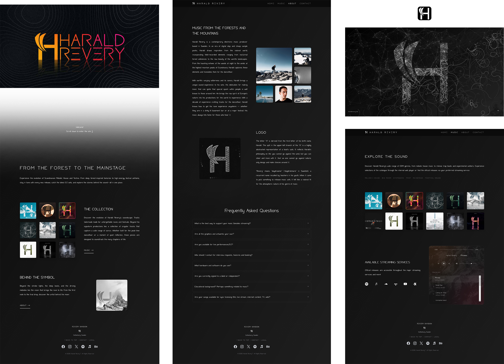

# Harald Revery official website
 
 

---

## Harald Revery official website, made with Tailwind CSS, Alpine.js and GLightbox.
Alpine.js was used for "navigation bar reveal when scroll" on older browsers and to run a custom made audio player. GLightbox for pop out image sliders when the user clicks an image (the CSS trick was not good enough). 

* Tailwind CSS: [Website](https://tailwindcss.com/), [Github](https://github.com/tailwindlabs/tailwindcss)
* Alpine.js [Website](https://alpinejs.dev/), [Github](https://github.com/alpinejs/alpine)
* GLightbox [Website](https://biati-digital.github.io/glightbox/), [Github](https://github.com/biati-digital/glightbox)

Main LLM models used to generate and troubleshoot code:
* Anthropic: Claude AI (Sonnet 4.5)
* Google: Gemini 
* xAI: Grok
* DeepSeek

## Notebook (blog/article part)
To get the blog ("notebook") have a nice structure and so on, I used Eleventy to generate html pages from markdown text and to create a page with all the "cards" containing sortable tags, thumbnails and date for each post on the site. Node.js was used to run Eleventy. Some pages contain Math.js for mathematical operations. 
* Node.js [Website](https://nodejs.org), [Github](https://github.com/nodejs/node)
* Eleventy [Website](https://www.11ty.dev/), [Github](https://github.com/11ty/eleventy/)
* Math.js [Website](https://mathjs.org/), [Github](https://github.com/josdejong/mathjs)

### Where notebook posts come from

Three input folders, all publishing to `notebook_pages/<slug>.html`. A slug may
live in exactly one of them; the build stops if two claim the same name.

| Folder | Source file | Use it for |
| --- | --- | --- |
| `input_markdown/` | `.md` | articles that are mostly words |
| `input_custom_post/` | `.html` body fragment | block posts, hand-written or page-builder exports |
| `input_custom_html_pages/` | complete `.html` document | the browser apps and rare one-offs |

The first two are **fragments**: the `<head>`, the nav and the footer are added
by the layouts in `eleventy_settings/` at build time, so changing the nav once
reaches every one of those pages on the next build. Only
`input_custom_html_pages/` carries its own copy of that chrome, which is correct
for a standalone app and is why that folder still exists — but it does mean those
pages have to be edited by hand when the nav changes. Prefer `input_custom_post/`
for anything that is an article rather than an application.

To write one, copy blocks out of `input_custom_post/_template.html` and read
`input_custom_post/README.txt`. Longer background, and the reasoning behind the
formats, is in `information/INPUT_CUSTOM_POSTS.md`.

Note that `eleventy.config.js` is compiled INTO the standalone binaries. If you
change it, recompile with `eleventy_binary/compile.sh` — otherwise the binary
keeps building from its own stale copy, and new pages silently do not appear.
`./healthcheck.sh` reports that case as "live source that published no page".

## Revery Notebook (markdown editor)
For the text editor I used CodeMirror, markdown-it and KaTeX to get the markdown and latex syntax to render and work correctly. I used highlight.js to make code blocks have colors for different programming languages. DOMPurify is used to some safety precautions.

* KaTeX [Website](https://katex.org/), [Github](https://github.com/KaTeX/KaTeX) 
* markdown-it [Website](https://markdown-it.github.io/), [Github](https://github.com/markdown-it/markdown-it) 
* markdown-it-texmath [Github](https://github.com/goessner/markdown-it-texmath)
* highlight.js [Website](https://highlightjs.org/), [Github](https://github.com/highlightjs/highlight.js) 
* CodeMirror [Website](https://codemirror.net/), [Github](https://github.com/codemirror/dev) 
* DOMPurify [Website](https://cure53.de/purify), [Github](https://github.com/cure53/dompurify) 

---

Personal setup for this project:
* Windows 10 with Firefox, Edge Zen with JavaScript blocker
* VS Code with the Live Server extension by Ritwick Dey (fine for looking at one page; but the site links clean URLs like `/about`, which Live Server cannot resolve, so clicking between pages there 404s. To click through the site locally, use `npm start` (http://localhost:8080), which serves `/about` from `about.html` the way GitHub Pages does)
* Tailwind CSS v4.3.1  (tailwindcss-windows-x64.exe renamed to tw.exe; same version as tailwindcss-linux-x64)

### Building the site

One command builds everything, in the only correct order: the CSS (Tailwind),
then the pages (Eleventy), then the health check below.

```
./build.sh            # Linux   (chmod +x build.sh once, if needed)
build.bat             # Windows: double-click it
```

Add `--quiet` to see only the health-check sections that found something. The
order matters because every page links `/main.css?v=<hash of main.css>` (see
`_data/assets.js`): the CSS is cached for 186 days, so a changed stylesheet has
to be a new URL, and the pages must be built after the CSS they point at.

`build.sh` uses the standalone Eleventy binary, and falls back to Node when the
binary is missing or older than `eleventy.config.js`. The binaries and Tailwind
are kept zipped in git: unzip `tailwindcss-linux-x64.zip` / `tw.zip` and the
`eleventy-*.zip` for your platform next to this file first.

While working on styles, `./dev.sh` (Windows: `dev.bat`) keeps Tailwind running
in watch mode. There is one stylesheet, `main.css`; `input.css` pulls in
`input_prose.css` for the notebook/prose rules.

Stale pages are not deleted by the build (it only writes). If you draft, rename
or delete a post, the health check lists the leftover page under "orphaned build
output" - delete what it names.

### Refusing out-of-date commits (recommended)

GitHub Pages serves the committed files as they are, so a commit that changes a
source but not what it builds to ships stale pages. A pre-commit hook runs
`build.sh` and refuses the commit when the build changes files or the health
check finds an error. Enable it once per clone (Linux and Windows):

```
git config core.hooksPath githooks
```

Skip it for one commit with `git commit --no-verify`; turn it off with
`git config --unset core.hooksPath`.

### Hosting requirement: clean URLs

Every internal link, canonical, sitemap entry and feed item uses clean URLs
(`/music`, `/notebook_pages/gamesettings`), and the files are `music.html` etc.
The host must serve `/x` from `x.html`. GitHub Pages does, and so does
`npm start` (the Eleventy dev server). A plain static server does not
(python `http.server`, nginx/Apache defaults): every page link 404s there.

Watch out for `music/` and `download/`: they are real folders (the audio and
wallpaper files) next to `music.html` and `download.html`. GitHub Pages serves
`music.html` for `/music` even so (measured 2026-09-28), but `/music/` is a
404, and on a plain server `/music` shows a directory listing of the audio
files. When moving to another host, check `/music` and `/download` first.
For nginx the rule is `try_files $uri $uri.html $uri/ =404;`. `wrangler.jsonc`
(Cloudflare) would handle the mapping, but Cloudflare refuses single files over
25 MiB, and the FLAC files are bigger.

## Health check

Before pushing, scan the site for broken image/link paths, references whose casing
doesn't match the file on disk (these work locally but 404 on GitHub Pages), and
oversized images. It only reads and reports - it never changes a file.

On windows, be in the folder and run:

```
Just double click the "healthcheck.bat" and it will print the report.
```

On Linux, be in the folder and run:

```
chmod +x healthcheck.sh
./healthcheck.sh
```

Add `--quiet` to print only the sections that found something, or `--help` for the
size thresholds. Exit code is 1 when there are errors, so it can gate a deploy.
`build.sh` / `build.bat` run it for you after every build.

Besides links and images it checks the URLs in `sitemap.xml`, `feed.xml` and
`search-index.json`, pages left behind by a drafted/renamed/deleted post, a post
that published no page (usually a stale Eleventy binary), and `?v=` versions
that no longer match `main.css` (the two hand-written pages `h/1dgraph.html` and
`h/2dphaseportrait.html` carry theirs by hand - it tells you the new value).

Worth knowing: the casing check is the reason there are two scripts rather than one.
Windows and macOS filesystems ignore case, so a wrong-cased reference resolves fine on
the machine you wrote it on and only breaks once GitHub Pages serves it. Running
`healthcheck.bat` on Windows catches it there, at the point the mistake is made.

For more information, see the /information folder containing .md files. 

If nothing works, install Node.js and run (no npm install needed - `node_modules/`
is committed):

```
npm run build     # or: npm start, for the live-reload dev server
```

Note: I avoid npm since you depend on so many servers for it to work and you never know what the code is, hence why you should compile binaries that works and stick with them. Only use npm when changing logic for this website and compile in the end when everything works.

---

There is also some python code here, but that is only to generate som background svg's, to create the "topology map" to give the website some texture. Note that the svg outputs are a little large in file sizes (for a website) and can be optmized even more using online svg optimizers.

--- 

All rights reserved Harald Revery

 
